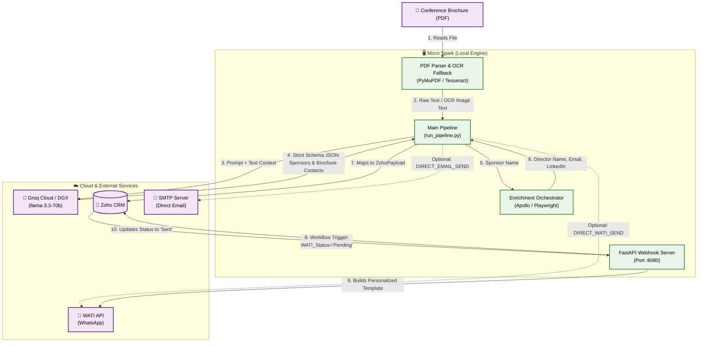

# 🚀 Spark Fleet: Autonomous Revenue Engine

Welcome to the **Spark Fleet** project! This is a completely automated, AI-driven pipeline designed to find high-intent leads from medical conference brochures, discover the right decision-makers, inject them into your CRM, and automatically send personalized WhatsApp messages and emails.

## 🌟 Pipeline Features

- **Robust PDF Parsing & OCR**: Extracts text using PyMuPDF. If a brochure is scanned or image-heavy, the pipeline automatically falls back to **Tesseract OCR** to read text directly from the images.
- **AI Sponsor Extraction**: Uses cloud-based LLM inference via **Groq (llama-3.3-70b)** to intelligently parse the brochure text and extract only the actual sponsors (ignoring attendees/speakers), their sponsorship tier, and any contact information listed. Falls back to `qwen-qwq-32b` if the primary model is unavailable.
- **Dual Enrichment Strategy**: 
  1. Searches the actual brochure text for localized emails/phones tightly coupled to the sponsor's name.
  2. Uses public-web discovery (Playwright/DuckDuckGo) or **Apollo.io** to find the Marketing Director's name and LinkedIn profile.
- **Direct & Webhook Outreach**: Supports sending direct SMTP emails with an interactive terminal approval prompt (`y/n/a`), direct WATI WhatsApp messages, or deferring to Zoho CRM's webhook for scheduled execution.
- **Caching & Idempotency**: Automatically queries Zoho before processing a PDF to ensure you never waste LLM tokens or send duplicate messages to the same sponsor twice.

---

## 🏗️ The Logical Architecture

The pipeline is split into two logical brains to bypass API timeouts and hardware limitations:
1. **The Micro Spark**: Your local machine running the extraction routing, enrichment scraping, and continuous webhook server.
2. **The Macro Spark / Cloud**: The heavy reasoning brain (Groq cloud / Local DGX) doing the complex unstructured data extraction.

### Architecture Flowchart



---

## 🛑 The "Timeout Trap" & How We Bypass It

**The Problem**: Zoho CRM Catalyst functions (and similar cloud automation runners) have strict execution timeout limits (typically 10–30 seconds). However, searching for decision-makers on the public web, performing LinkedIn scrapes, extracting text from scanned PDFs, and running LLM extraction prompts takes several minutes per company. Attempting to execute this sequentially within a CRM action leads to timeouts and system failures.

**The Spark Fleet Solution**: We completely decouple long-running operations from the CRM:
1. The **Micro Spark** runs the entire pipeline locally, taking as much time as needed (even 10+ minutes for a massive brochure) to parse, reason, and enrich without cloud restrictions.
2. It pushes the completed lead payload to Zoho CRM via the Leads REST API, initializing the custom `WATI_Status` field to `"Pending"`.
3. Zoho CRM instantly executes a Workflow Rule on lead creation/update, firing an HTTP webhook callback to the Micro Spark's always-on FastAPI webhook server (`webhook_server.py`) exposed via Ngrok.
4. The local server processes the webhook request, immediately replies to Zoho with `200 OK` (satisfying the CRM timeout in milliseconds), and asynchronously dispatches the personalized WhatsApp outreach via WATI in the background.
5. Once the message is sent or fails, the webhook server updates the lead status in Zoho to `"Sent"` or `"Failed"`.

```
Zoho CRM (New Lead) ──[WATI_Status = Pending]──> FastAPI Webhook Server
                                                       │
   FastAPI <──[200 OK (Instant Response)]──────────────┤  (satisfies CRM timeout)
                                                       ▼
                                            WATI API (WhatsApp Send)
                                                       │
   Zoho CRM <──[Update WATI_Status: Sent/Failed]───────┘
```

---

## 📂 Project Architecture

```
spark-fleet-revenue-engine/
├── .env                          # Local credentials & configurations
├── run_pipeline.py               # Main CLI orchestration pipeline
├── generate_zoho_token.py        # Interactive Zoho OAuth token generator
├── pyproject.toml                # Build system & dependencies metadata
├── src/
│   └── spark_fleet/
│       ├── __init__.py
│       ├── pdf_parser.py         # PyMuPDF text & image extractor with OCR fallback
│       ├── macro_client.py       # OpenAI-compatible Groq/LLM client & JSON regex salvage
│       ├── enrichment.py         # Rate-limit state and provider execution orchestrator
│       ├── zoho.py               # Zoho CRM Leads API mapper & Token refresher
│       ├── wati.py               # WATI WhatsApp template payload generator
│       ├── webhook_server.py     # FastAPI server for Zoho & Apollo webhooks
│       └── adapters/
│           ├── free_people_provider.py     # Public web scraper (DDG, sites, Apollo matches)
│           ├── apollo_provider.py          # Native Apollo search & match API client
│           ├── proxycurl_provider.py       # Proxycurl employee search API client
│           ├── playwright_provider.py      # Playwright browser search automation
│           └── fallback_people_provider.py # Cascading fallback (e.g. Apollo -> Free scraper)
└── tests/                        # Full Unit & E2E integration test suite
```

---

## ⚙️ Advanced Pipeline Workflows

### 🏎️ Pre-flight CRM Idempotency Checks
To prevent duplicate execution and save API credits, `run_pipeline.py` executes a pre-flight check for each PDF via `zoho.has_conference_leads`.
- If a lead with the same `Conference_Name` and `Lead_Source` already exists in Zoho CRM, the pipeline skips LLM and scraping phases.
- Instead, it queries Zoho, retrieves the previously pushed leads, and displays their current outreach statuses in a clean terminal audit table.

### 🛡️ LLM JSON Regex Salvage
Large language models can occasionally truncate responses or wrap JSON payloads in markdown fences when processing large brochure texts. `macro_client.py` implements a robust regex-based extraction and salvage routine:
1. **Markdown Fence Stripping**: Extracts code wrapped in triple backticks.
2. **Regex Recovery**: If JSON parsing fails due to truncation, the client scans the raw response using regex patterns to salvage partial `{"company_name": "..."}` objects, ensuring that at least some leads are recovered rather than failing the entire run.

### 🤝 Asynchronous Apollo Phone Webhook
Apollo's cell phone waterfall matching is an asynchronous process. When `apollo_provider.py` requests cell phone data, Apollo triggers a webhook callback upon discovery.
- The FastAPI webhook server listens on `/webhook/apollo-enrichment` for Apollo's response.
- Once phone/email data is received, the server updates the respective Zoho Lead with the new contact details.
- If a mobile phone number is added, the server changes the `WATI_Status` to `"Pending"`, which automatically triggers the Zoho workflow rules and dispatches the WhatsApp message.

---

## 💼 Zoho CRM Setup & Custom Fields

Before running the pipeline, ensure the following custom fields are created in the **Leads** module of your Zoho CRM:

| Field Label | API Name | Type | Options / Description |
| :--- | :--- | :--- | :--- |
| **Sponsor Tier** | `Sponsor_Tier` | Single Line | e.g., *Gold*, *Platinum*, *Silver*, *Unknown* |
| **Conference Name** | `Conference_Name` | Single Line | Name of the PDF file/conference |
| **WATI Status** | `WATI_Status` | Picklist | `Pending`, `Not Sent - Missing Phone`, `Sent`, `Failed` |
| **WATI Template Key** | `WATI_Template_Key` | Single Line | Default: `medical_conference_sponsor_intro_v1` |
| **WATI Personalized Msg** | `WATI_Personalized_Msg` | Multi Line | Fully rendered text copy of the WhatsApp message |
| **LinkedIn Profile** | `LinkedIn_Profile` | URL | LinkedIn URL of the Marketing Director |

---

## 🛠️ Installation & Setup

### 1. Install Dependencies
Initialize the editable package and pull core components:
```powershell
# Install the core package in editable mode
pip install -e .

# Install PDF parsing & OCR tools
pip install PyMuPDF pytesseract pillow

# Install Playwright browser dependencies
pip install playwright
playwright install chromium
```
> [!NOTE]
> **Windows OCR Fallback**: To support scanned PDFs, download and install the [Tesseract OCR Windows binary](https://github.com/UB-Mannheim/tesseract/wiki) and ensure the path is set in `.env` (defaults to `C:\Program Files\Tesseract-OCR\tesseract.exe`).

### 2. Obtain Zoho CRM Tokens
To wire up Zoho CRM with OAuth, execute the token generator utility:
```powershell
python generate_zoho_token.py
```
This utility walks you through generating a permanent **Refresh Token** by logging into your Zoho Developer Console.

---

## 📋 Environment Configuration Reference

Create a `.env` file in the root directory. Below is the complete configuration matrix:

| Variable | Description | Required | Example Value |
| :--- | :--- | :--- | :--- |
| **`ZOHO_CLIENT_ID`** | Zoho API Console Client ID | **Yes** | `1000.XXXXXXXXXXXXXXXXXXXXXXXXXX` |
| **`ZOHO_CLIENT_SECRET`** | Zoho API Console Client Secret | **Yes** | `xxxxxxxxxxxxxxxxxxxxxxxxxxxxxxxx` |
| **`ZOHO_REFRESH_TOKEN`** | Long-lived Zoho CRM Refresh Token | **Yes** | `1000.xxxxxxxxxxxxxxxxxxxxxxxxxxxxxxxx` |
| **`ZOHO_DOMAIN`** | Regional Zoho domain | No (Default: `zoho.com`) | `zoho.in` (for India), `zoho.eu` |
| **`GROQ_API_KEY`** | Groq API Key (Cloud inference) | **Yes** | `gsk_xxxxxxxxxxxxxxxxxxxx` |
| **`LLM_MODEL`** | Groq Model ID for extraction | No | `llama-3.3-70b-versatile` |
| **`APOLLO_API_KEY`** | Apollo.io API Key | No | `api_key_xxxxxxxxxxxxxxxx` |
| **`APOLLO_PHONE_WEBHOOK_URL`** | Ngrok URL pointing to Apollo webhook receiver | No | `https://xxxx.ngrok-free.app/webhook/apollo-enrichment` |
| **`DIRECT_EMAIL_SEND`** | Interactive SMTP email outreach from CLI | No | `true` (enables CLI approval prompt) |
| **`DIRECT_WATI_SEND`** | Bypasses Zoho CRM, sends WhatsApp immediately | No | `false` |
| **`WATI_BASE_URL`** | WATI API Gateway URL | No | `https://live-server-xxxxx.wati.io` |
| **`WATI_API_TOKEN`** | WATI API Access Token | No | `eyJhbGciOiJIUzI1NiIsIn...` |
| **`SMTP_HOST`** | SMTP Outgoing Email Host | No | `smtp.gmail.com` |
| **`SMTP_PORT`** | SMTP Connection Port | No | `587` |
| **`SMTP_USER`** | SMTP Authorization User | No | `your_outbound_email@gmail.com` |
| **`SMTP_PASS`** | SMTP Outbound Password / App Password | No | `xxxx xxxx xxxx xxxx` |
| **`TESSERACT_CMD`** | Local path to Tesseract executable | No | `C:\Program Files\Tesseract-OCR\tesseract.exe` |

---

## 🚀 Execution Guide

### 1. Launch the FastAPI Webhook Server (Terminal 1)
To listen for webhook callbacks from Zoho CRM and Apollo, run:
```powershell
# Expose the local FastAPI port via ngrok first
ngrok http 8080

# Start the FastAPI webhook app
uvicorn spark_fleet.webhook_server:app --host 0.0.0.0 --port 8080
```

### 2. Execute the Pipeline (Terminal 2)
Place your medical conference PDF brochures (e.g., `ventures-brochure.pdf`) in the project root directory and run:
```powershell
python run_pipeline.py
```

- The pipeline extracts sponsor tiers and brochure-localized emails/phones.
- It queries the search providers (Apollo, Playwright, or public web) to enrich contact records.
- If `DIRECT_EMAIL_SEND=true` is enabled, the pipeline halts and prints an email preview in the terminal, accepting user commands:
  - `y` (yes): Sends the email immediately.
  - `n` (no): Skips outreach for this lead.
  - `a` (all): Sends all remaining email drafts in this run without prompting again.
- Pushes finalized leads to Zoho CRM to trigger the background WhatsApp outreach.
- Outputs a formatted markdown-like summary report of the run.

