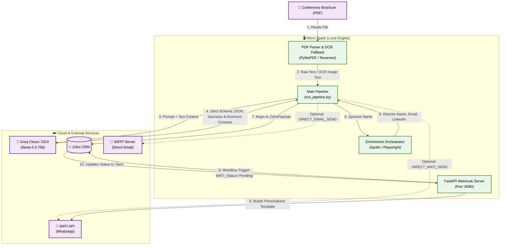

# 🚀 Spark Fleet: Autonomous Revenue Engine

Welcome to the **Spark Fleet** project! This is a completely automated, AI-driven pipeline designed to find high-intent leads from medical conference brochures, discover the right decision-makers, inject them into your CRM, and automatically send personalized WhatsApp messages and emails.

## 🌟 Pipeline Features

- **Robust PDF Parsing & OCR**: Extracts text using PyMuPDF. If a brochure is scanned or image-heavy, the pipeline automatically falls back to **Tesseract OCR** to read text directly from the images.
- **AI Sponsor Extraction**: Uses cloud-based LLM inference via **Groq (llama-3.3-70b)** to intelligently parse the brochure text and extract only the actual sponsors (ignoring attendees/speakers), their sponsorship tier, and any contact information listed. Falls back to `qwen-qwq-32b` if the primary model is unavailable.
- **Dual Enrichment Strategy**: 
  1. Searches the actual brochure text for localized emails/phones tightly coupled to the sponsor's name.
  2. Uses public-web discovery (Playwright/DuckDuckGo) or **Apollo.io** to find the Marketing Director's name and LinkedIn profile.
- **Direct & Webhook Outreach**: Supports sending direct SMTP emails with an interactive terminal approval prompt (`y/n/a`), direct WATI WhatsApp messages, or deferring to Zoho CRM's webhook for scheduled execution.
- **Caching & Idempotency**: Automatically queries Zoho before processing a PDF to ensure you never waste LLM tokens or send duplicate messages to the same sponsor twice.

---

## 🏗️ The Logical Architecture

The pipeline is split into two logical brains to bypass API timeouts and hardware limitations:
1. **The Micro Spark**: Your local machine running the extraction routing, enrichment scraping, and continuous webhook server.
2. **The Macro Spark / Cloud**: The heavy reasoning brain (Groq cloud / Local DGX) doing the complex unstructured data extraction.

### Architecture Flowchart



---

## 🛑 The "Timeout Trap" & How We Bypass It

**The Problem**: Zoho Catalyst (and most CRM automation functions) have strict execution timeout limits (usually 10-30 seconds). Web scraping LinkedIn, searching for contacts, and running large language models takes several minutes per company. If you try to run this natively inside Zoho, it will crash and fail every single time.

**The Spark Fleet Solution**: We completely decouple the heavy lifting.
1. The **Micro Spark** runs the entire pipeline locally. It takes as much time as it needs (even 10+ minutes for a massive PDF) to extract, reason, and enrich without any cloud timeout restrictions.
2. It pushes a finished, formatted lead into Zoho CRM with a special `WATI_Status` field set to `"Pending"`.
3. Zoho CRM sees the new lead and fires a lightning-fast HTTP Webhook back to the Micro Spark's local FastAPI server (`webhook_server.py` exposed via Ngrok).
4. The local server receives the trigger, immediately returns a `200 OK` to Zoho (satisfying the CRM timeout in under 1 second), and then safely dispatches the personalized WhatsApp message via WATI in the background.

---

## ⚙️ How to Run the Pipeline

### 1. Install Dependencies
```powershell
# Install the core pipeline
pip install -e .

# Install PDF and OCR tools
pip install PyMuPDF pytesseract pillow

# Install Playwright and its browser
pip install playwright
playwright install chromium
```
*(Note for Windows users: You must download and install the [Tesseract Windows executable](https://github.com/UB-Mannheim/tesseract/wiki) for the OCR fallback to work).*

### 2. Configure Your `.env` File
Create a `.env` file in the root directory with the following keys:
```env
# Zoho CRM OAuth
ZOHO_CLIENT_ID="your_client_id"
ZOHO_CLIENT_SECRET="your_secret"
ZOHO_REFRESH_TOKEN="your_refresh_token"
ZOHO_DOMAIN="zoho.in"

# Groq Cloud Inference (Free & Fast)
GROQ_API_KEY="your_groq_key"

# Optional: Apollo API for Email Enrichment
APOLLO_API_KEY="your_apollo_key"

# Optional: Direct Outreach (Bypass Zoho Webhook)
DIRECT_EMAIL_SEND=true
DIRECT_WATI_SEND=true

# WATI Credentials
WATI_BASE_URL="https://live-server.wati.io"
WATI_API_TOKEN="your_wati_token"

# SMTP Credentials (for Direct Email)
SMTP_HOST="smtp.gmail.com"
SMTP_PORT=587
SMTP_USER="your_email@gmail.com"
SMTP_PASS="your_app_password"
```

### 3. Start the Webhook Server (Terminal 1)
Leave this running 24/7. It listens for triggers from Zoho CRM to send WhatsApp messages.
```powershell
# Expose your local port to the internet first: ngrok http 8080
uvicorn spark_fleet.webhook_server:app --host 0.0.0.0 --port 8080
```

### 4. Run the Pipeline (Terminal 2)
Place any medical conference PDF brochures in the project folder and run:
```powershell
python run_pipeline.py
```
The pipeline will automatically process the PDFs, generate a summary report in your terminal, interactively ask for email approvals (if enabled), and push everything to Zoho CRM!
